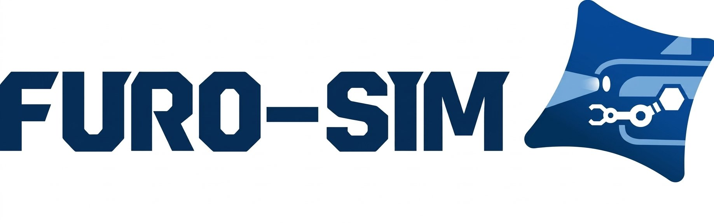

# FURo-Sim: Field and Underwater Robotics Simulator

<p align="center">
  
</p>

<p align="center">
  <a href="https://youtu.be/cEMKJDBZpxY">
    
  </a>
  <br/>
  <em>▶ Demo Video (click to watch on YouTube)</em>
</p>

> **Notice:** This is a **partial release** of FURo-Sim made available to support an in-progress paper review. Some components — see the [TODO](#todo) section — will be released after the review is complete.

FURo-Sim is an open-source, GPU-accelerated, physics-based sonar simulation framework built on [Unreal Engine 5.4](https://www.unrealengine.com/) for underwater robotic perception research. Originally developed upon the [AirSim](https://github.com/microsoft/AirSim) (Microsoft) and [Colosseum](https://github.com/CodexLabsLLC/Colosseum) (Codex Laboratories) frameworks, FURo-Sim extends their capabilities with support for autonomous underwater vehicles (AUVs), autonomous surface vehicles (ASVs), and physically realistic underwater acoustic sensing. It generates physically realistic synthetic sonar imagery together with pixel-accurate ground-truth annotations at negligible marginal cost, addressing the scarcity and high acquisition cost of real underwater sonar datasets.


---

## Key Features
- Acoustic ray tracing GPU-accelerated sonar simulation (FLS, SSS)
- Full dynamics-based AUV & ASV simulation
- Multi-agent support
- Real-time realistic simulation powered by Unreal Engine 5.4
- Windows / Linux support
- Python client API (`PythonClient/auv/`, `PythonClient/fls/`, `PythonClient/sss/`)
- C++ client API (`HelloAuv/`)
- ROS (Noetic) / ROS2 (Humble) integration with AUV, FLS, SSS, DVL, Pressure support

---

## Unreal Engine Version

This project is built on **Unreal Engine 5.4**.

---

## Supported Operating Systems

| OS | Version |
|----|---------|
| Windows | Windows 10 / 11 |
| Linux | Ubuntu 20.04 / 22.04 |

---

## Repository Structure

```
FURo-Sim/
├── AirLib/                  # Core simulation library
├── HelloAuv/                # AUV C++ client example
├── PythonClient/
│   ├── furosim/             # Python client package
│   ├── auv/                 # AUV examples
│   ├── fls/                 # Forward-Looking Sonar (FLS) examples
│   └── sss/                 # Side-Scan Sonar (SSS) examples
├── ros/                     # ROS (Noetic) integration
├── ros2/                    # ROS2 (Humble) integration
├── settings_examples/       # Example settings.json files
└── LICENSE
```

---

## Download (Pre-built Binary)

Download the latest release from [GitHub Releases](https://github.com/heekyu-kweon/FURo-Sim/releases).

### Windows

1. Download and extract `FURoSimDemo_v0.1.1_Windows.zip`
2. Copy a settings file to `Documents\FURo-Sim\settings.json` (see [`settings_examples/`](settings_examples/) for reference)
3. Run `FURoSimDemo.exe`

### Linux (Ubuntu 20.04 / 22.04)

1. Download and extract `FURoSimDemo_v0.1.1_Linux.tar.xz`
```bash
tar -xf FURoSimDemo_v0.1.1_Linux.tar.xz
```
2. Copy a settings file to `~/Documents/FURo-Sim/settings.json` (see [`settings_examples/`](settings_examples/) for reference)
3. Run the simulator
```bash
./FURoSimDemo.sh
```

---

## Recommended Development Environment

We recommend using **Windows + WSL (Windows Subsystem for Linux)** as the development environment:

- **Windows**: Run the Unreal Engine 5.4 simulator binary (FURoSimDemo.exe)
- **WSL (Ubuntu 20.04 / 22.04)**: Use the Python client, ROS/ROS2 packages, and build AirLib from source

This combination allows you to run the simulator on Windows while leveraging Linux tooling for development and ROS integration.

---

## Documentation

> Documentation is currently under preparation and will be available in a future release.

---

## TODO

- [ ] Release Unreal Project source code
- [ ] Release ASV (Autonomous Surface Vehicle) support
- [ ] Release documentation

---

## Citation

If you use FURo-Sim in your research, please cite:

```bibtex
@inproceedings{kweon2025furosim,
  title={Development of Maritime Robotics Simulator Using Unreal Engine 5},
  author={Kweon, Heekyu and Sim, Hyeonmin and Joe, Hangil},
  booktitle={2025 22nd International Conference on Ubiquitous Robots (UR)},
  year={2025},
  organization={IEEE}
}
```

---

## License

This project is released under the MIT License.
FURo-Sim modifications: Copyright (c) FURo Lab. 2026

Please review the [LICENSE](LICENSE) file for full details, including the original AirSim (Microsoft) and Colosseum (Codex Laboratories LLC) licenses.

---

## Acknowledgements

- [AirSim](https://github.com/microsoft/AirSim) — Microsoft Corporation
- [Colosseum](https://github.com/CodexLabsLLC/Colosseum) — Codex Laboratories LLC
